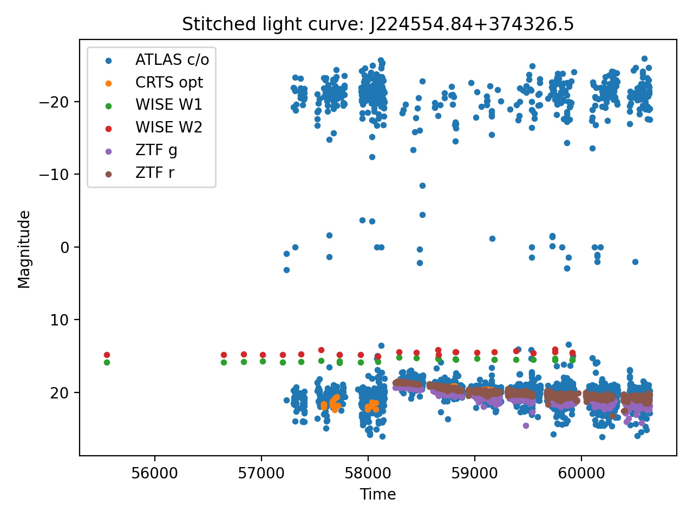
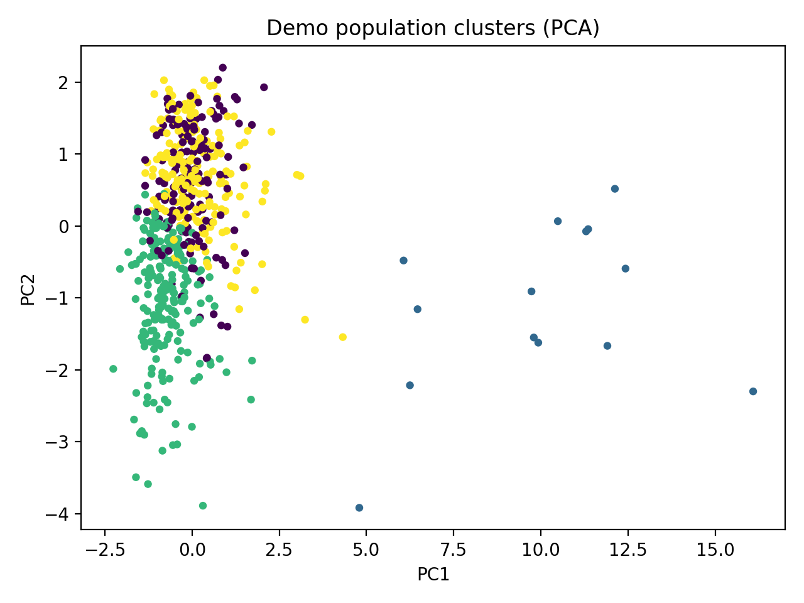
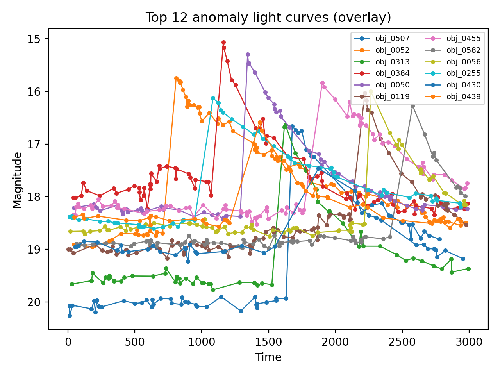

# Exploratory Unsupervised Analysis of Astronomical Light Curve Variability

This project explores the use of unsupervised machine learning techniques to analyze
astronomical light curves (brightness vs time) and identify different variability
behaviors without predefined labels.

The work is motivated by modern time-domain surveys, where millions of light curves
are collected and manual inspection is infeasible. The project focuses on clarity,
interpretability, and scientific reasoning rather than complex models.

---

## Project Goals

- Load and preprocess astronomical light curve data
- Extract simple, interpretable variability features
- Explore whether distinct variability behaviors emerge naturally via clustering
- Identify extreme or unusual variability patterns using anomaly detection
- Build a reproducible and extensible analysis pipeline

---

## Data

### Multi-survey case study (real data)
The repository includes a case study using public photometric data from multiple
astronomical surveys (ZTF, CRTS, ATLAS, WISE) for the object
**J224554.84+374326.5**, taken from the companion dataset to:

> *An extremely luminous flare recorded from a supermassive black hole*  
> Nature Astronomy (2025)

This dataset demonstrates realistic challenges such as heterogeneous surveys,
irregular sampling, and multi-band observations.

### Demo population (simulated data)
To explore unsupervised learning at the population level, a simulated dataset of
hundreds of light curves is generated. The simulation includes:
- stochastic variability (random-walk–like behavior)
- injected flare-like events to mimic rare transients

---

## Method Overview

1. **Preprocessing**
   - Standardize light curves to a common schema (time, magnitude, band, survey)
   - Stitch multi-survey observations into long-baseline time series

2. **Feature Extraction**
   - Mean and standard deviation of brightness
   - Robust amplitude (95th–5th percentile)
   - Maximum brightness jump
   - Time span of observations
   - Long-term trend (slope)
   - Skewness

3. **Unsupervised Analysis**
   - KMeans clustering to group objects by variability behavior
   - PCA for low-dimensional visualization
   - Isolation Forest for anomaly scoring and rare-event discovery

---

## Example Outputs

### Stitched multi-survey light curve (real data)


### Clustering of simulated population (PCA projection)


### Top anomalous light curves


---

## How to Run

```bash
python -m venv .venv
source .venv/bin/activate
pip install -r requirements.txt

PYTHONPATH=src python scripts/run_superman_pipeline.py
PYTHONPATH=src python scripts/run_demo_population.py
